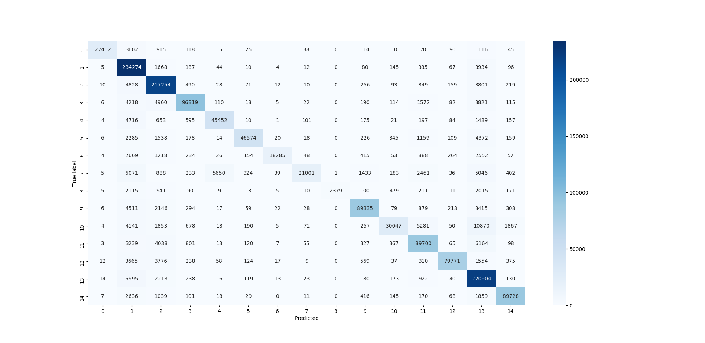
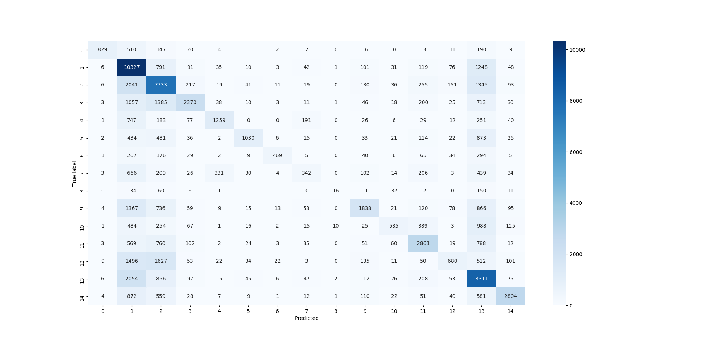

# AI_Internship
This is vietnhh branch, AI intership at BAP software. 

### Folder tree:
```
|   GetTitle.py
|   MultinomialNB.py
|   NaiveBayes.ipynb
|   NaiveBayes.py
|   ProcessDataClass.py
|   README.md
|   vectorized_url.pickle
|
+---data
|       URL Classification.csv
|
+---results
|       confusion_matrix_test.png
|       confusion_matrix_train.png
|       visualize.png
|
\---__pycache__
```
# Libraries
- seaborn
- numpy
- matplotlib
- time
- sklearn.metrics
- sklearn.model_selection
- nltk
- scipy
- math
- pickle
- wordninja

# Naive Bayes

```
cd vietnhh
cd NaiveBayes
python NaiveBayes.py
```
# Notebook
To get more information from this project, please read my notebook at:

https://github.com/nhhviet98/naive-bayes-url-classification/blob/master/NaiveBayes.ipynb

### Training Set

```
      precision    recall  f1-score   support

           0       1.00      0.82      0.90     28173
           1       0.81      0.97      0.89    203065
           2       0.89      0.95      0.92    192118
           3       0.96      0.87      0.91     94447
           4       0.90      0.85      0.87     45369
           5       0.98      0.82      0.89     47982
           6       0.99      0.69      0.81     22670
           7       0.98      0.51      0.67     36723
           8       1.00      0.29      0.44      7186
           9       0.95      0.89      0.92     85365
          10       0.94      0.56      0.70     46631
          11       0.86      0.86      0.86     88283
          12       0.99      0.89      0.93     76410
          13       0.82      0.95      0.88    194816
          14       0.96      0.94      0.95     81144

    accuracy                           0.89   1250382
   macro avg       0.93      0.79      0.84   1250382
weighted avg       0.90      0.89      0.88   1250382
```

<p align="center">

</p>

### Testing Set

```
  precision    recall  f1-score   support

           0       0.95      0.47      0.63      7152
           1       0.44      0.79      0.56     50775
           2       0.48      0.63      0.55     48059
           3       0.71      0.39      0.50     23515
           4       0.73      0.46      0.56     11108
           5       0.80      0.32      0.46     12115
           6       0.86      0.34      0.48      5599
           7       0.45      0.15      0.22      9459
           8       0.53      0.03      0.05      1803
           9       0.65      0.33      0.44     21221
          10       0.61      0.19      0.29     11616
          11       0.61      0.52      0.56     22003
          12       0.58      0.14      0.23     18860
          13       0.48      0.70      0.57     49127
          14       0.80      0.55      0.65     20184

    accuracy                           0.53    312596
   macro avg       0.64      0.40      0.45    312596
weighted avg       0.58      0.53      0.51    312596
```

<p align="center">

</p>
